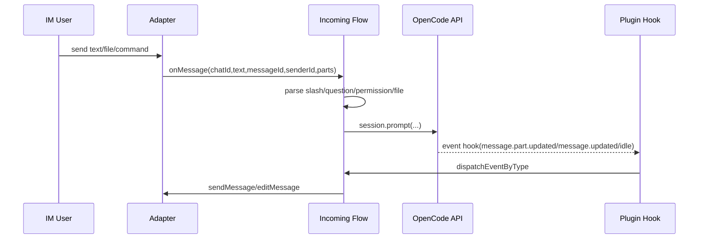
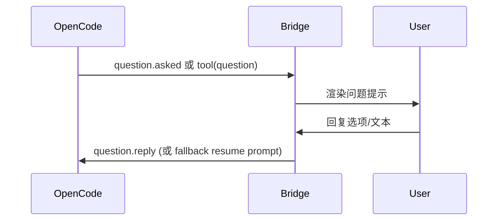
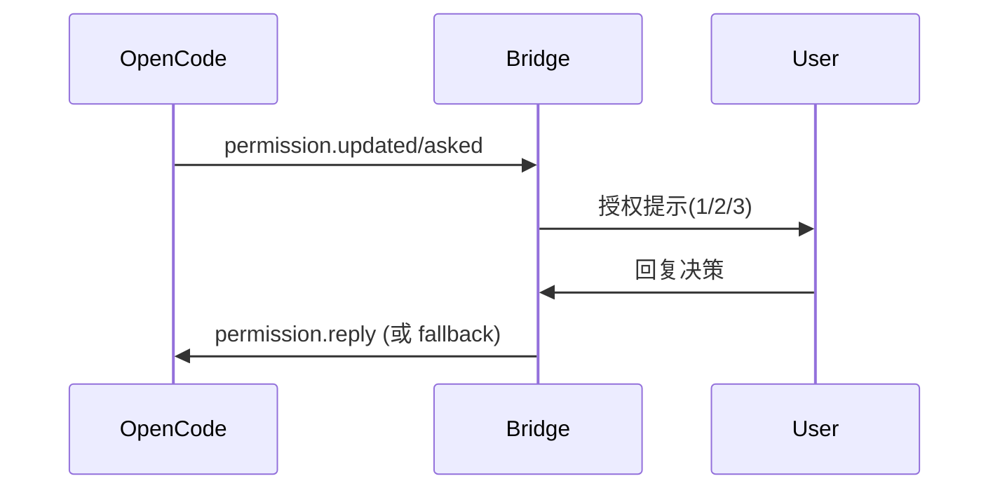

# Core Message Flow（核心消息流）

Doc Version: v1.0
Last Updated: 2026-03-04

## Purpose（目的）
定义桥接主链路的标准时序，保证功能演进时不破坏关键行为。

## Scope（范围）
- 入站消息流
- 事件回流与流式渲染
- Question / Permission 代理流
- 文件落盘与注入流

## Interface/Flow Definition（定义）
> 当前实现模式：`hook-only`。插件事件主链路由 `hooks.event` 驱动；SSE 保留为后续扩展能力。

### 总体时序


### 问题代理时序（Question Proxy）


### 权限代理时序（Permission Proxy）


### 文件链路
1. 入站 file part 调用 `saveFilePartToLocal`。
2. 默认入 pending 队列（非 `/savefile` 模式）。
3. 下一轮文本 prompt 前 `drainPendingFileParts` 注入。

## Examples（调用示例 + 报文示例）
Prompt body 示例：
```json
{
  "parts": [
    {
      "type": "text",
      "text": "请处理附件并给出总结"
    },
    {
      "type": "file",
      "filename": "design.png",
      "mime": "image/png",
      "url": "data:image/png;base64,..."
    }
  ]
}
```

平台回写示例：
```text
## Answer
处理中...

## Status
streaming
```

## Failure Modes（失败场景）
- 会话路由丢失：尝试从 metadata 恢复路由，仍失败则告警 `route.miss`。
- 回复 watchdog 超时：查询状态并尽力回放最近 assistant 输出。
- 消息编辑连续失败：降级新发消息，维持可见性。
- Question/Permission 超时：清理 pending 状态并提示用户重新发起。
- 事件链路异常：使用 `/status` 与 dispatch 日志进行人工对账（本期不引入静默异常自动判定）。

## Compatibility（兼容性）
- 流程定义对平台无关，平台差异通过 Adapter 层隔离。
- 事件类型在 `KNOWN_EVENT_TYPES` 兼容集合内做扩展。
- 本期仅启用 Hook 主链路；SSE/global listener 保留代码但不接入运行主链路。

## Observability（可观测性）
`/status` 最小健康快照固定字段：
- `eventSourceMode`
- `hookIngestedTotal`
- `hookLastEventType`
- `hookLastEventAt`

## Open Questions（未决事项）
- 是否将 question 与 permission 代理状态机独立为单独服务对象。
- 是否将 watchdog 阈值改为按平台动态配置。
