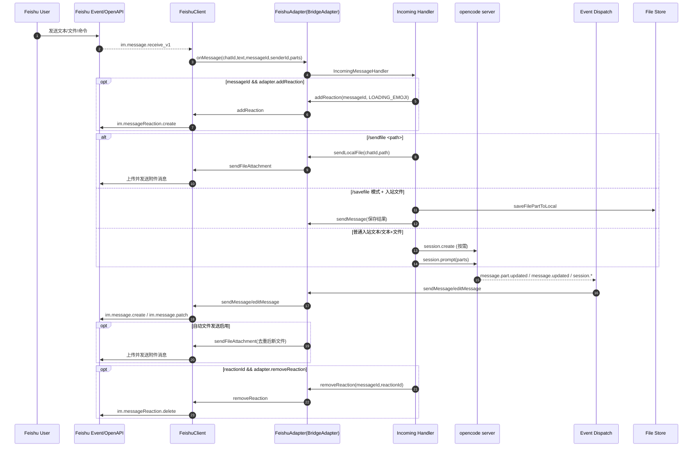

# Feishu Direct Call Flow（飞书直接调用链路）

Doc Version: v1.0
Last Updated: 2026-03-05

## Purpose（目的）
沉淀飞书场景下 `opencode server`、`BridgeAdapter` 与 Feishu OpenAPI 的直接调用关系，明确入站、出站、Reaction、文件发送的触发时机，作为联调与回归对照基线。

## Scope（范围）
- 飞书入站消息到 `opencode server` 的请求链路。
- `opencode server` 事件回流到飞书的回写链路。
- `addReaction/removeReaction` 的触发时机与 API 映射。
- 文件相关四类触发路径：入站文件、`/savefile`、`/sendfile`、自动文件发送。

不覆盖：
- 非飞书平台（TestApp/Telegram/QQ）协议细节。
- 配置项解释与部署步骤（由 `config-guide/*` 维护）。

## Interface/Flow Definition（定义）
### 总体时序（Feishu）


### 直接调用映射（Server -> Adapter -> Feishu API）
| opencode server / Hook 事件 | Adapter Interface | Feishu API / 行为 | 说明 |
|---|---|---|---|
| `api.session.create` / `api.session.prompt` | `start(onMessage)` 回调进入业务编排 | `im.message.receive_v1`（入站来源） | 入站消息先进入 Adapter，再转 OpenCode 会话调用 |
| `message.part.updated` / `message.updated` / `session.*` | `sendMessage` / `editMessage` | `im.message.create` / `im.message.patch` | 流式输出优先编辑，失败回退新发 |
| `api.permission.reply` / `api.question.reply` | 仍由 `onMessage` 触发回复解析 | Feishu 侧仅作为用户输入承载 | 用户在飞书回复后回传给 OpenCode |
| 入站处理生命周期 | `addReaction` / `removeReaction` | `im.messageReaction.create` / `im.messageReaction.delete` | 处理前加反应，`finally` 清理 |
| `/sendfile` 或自动文件发送 | `sendLocalFile`（命令）/ `sendMessage`+扫描文件（自动） | 文件上传 + 附件消息发送 | 命令强触发与自动触发并存 |

### Reaction 触发时机
1. 进入 `incoming` 后、业务处理前：若 `messageId && adapter.addReaction`，触发 `addReaction`。
2. 处理结束 `finally`：若 `messageId && reactionId && adapter.removeReaction`，触发 `removeReaction`。
3. 映射 API：`im.messageReaction.create/delete`。

### 文件发送触发时机
1. 入站文件：`im.message.receive_v1` 文件类消息 -> 下载资源 -> 组装 `FilePartInput`。
2. `/savefile`：直接落本地并回执，不进入 `session.prompt`。
3. `/sendfile <path>`：调用 `sendLocalFile`，立即通过 Bot 回传附件。
4. 自动发送：每次 `sendMessage/editMessage` 都扫描 markdown 文件引用；启用 `auto_send_local_files` 后会解析本地路径，按消息内签名去重后发送。

### 代码锚点（main 分支基线）
- `/Users/zy/Code/opencode/message-bridge-opencode-plugin/src/types.ts:11`
- `/Users/zy/Code/opencode/message-bridge-opencode-plugin/src/handler/flow/incoming.ts:175`
- `/Users/zy/Code/opencode/message-bridge-opencode-plugin/src/handler/flow/incoming.ts:383`
- `/Users/zy/Code/opencode/message-bridge-opencode-plugin/src/handler/flow/incoming.ts:815`
- `/Users/zy/Code/opencode/message-bridge-opencode-plugin/src/handler/event/dispatch.ts:505`
- `/Users/zy/Code/opencode/message-bridge-opencode-plugin/src/handler/command.ts:499`
- `/Users/zy/Code/opencode/message-bridge-opencode-plugin/src/handler/command.ts:518`
- `/Users/zy/Code/opencode/message-bridge-opencode-plugin/src/feishu/feishu.adapter.ts:56`
- `/Users/zy/Code/opencode/message-bridge-opencode-plugin/src/feishu/feishu.adapter.ts:91`
- `/Users/zy/Code/opencode/message-bridge-opencode-plugin/src/feishu/feishu.client.ts:923`
- `/Users/zy/Code/opencode/message-bridge-opencode-plugin/src/feishu/feishu.client.ts:966`
- `/Users/zy/Code/opencode/message-bridge-opencode-plugin/src/feishu/feishu.client.ts:1018`
- `/Users/zy/Code/opencode/message-bridge-opencode-plugin/src/feishu/feishu.client.ts:1035`
- `/Users/zy/Code/opencode/message-bridge-opencode-plugin/src/feishu/feishu.client.ts:1061`

## Examples（调用示例 + 报文示例）
入站事件（简化）：
```json
{
  "event_type": "im.message.receive_v1",
  "message": {
    "message_id": "om_xxx",
    "chat_id": "oc_xxx",
    "message_type": "text",
    "content": "{\"text\":\"/sendfile ./logs/run.log\"}"
  }
}
```

出站回写（简化）：
```ts
// dispatch -> adapter
const sent = await adapter.sendMessage(chatId, display);
const ok = await adapter.editMessage(chatId, sentId, nextDisplay);
```

## Failure Modes（失败场景）
- `editMessage` 失败：Bridge flow 回退 `sendMessage`，保证用户可见性。
- `addReaction` 或 `removeReaction` 失败：降级忽略，不中断主流程。
- 文件下载失败：返回错误提示，不阻塞后续文本交互。
- 自动文件发送重复：通过消息级签名去重避免重复回传。

## Compatibility（兼容性）
- 无对外 API/接口签名变更，仅新增文档归档。
- 调用关系描述以 `main` 分支代码为基线，不提前描述未实现行为。

## Open Questions（未决事项）
- 是否需要将文件自动发送策略抽象为平台无关能力协商（`supports`）。
- 是否需要为 Reaction 能力增加统一可观测指标（成功率/耗时）。
